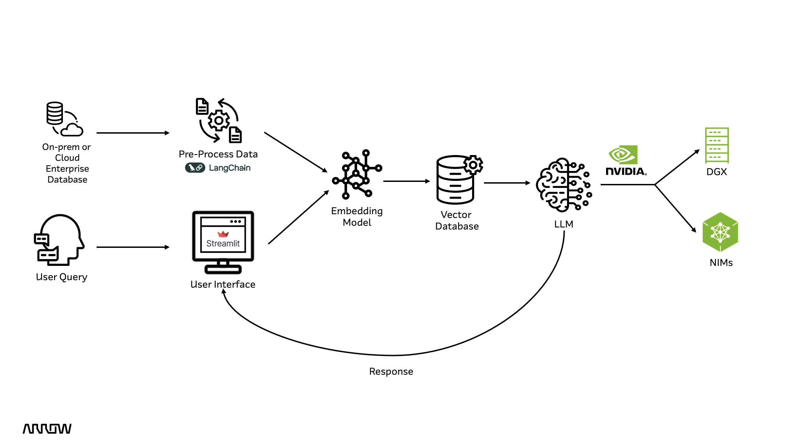
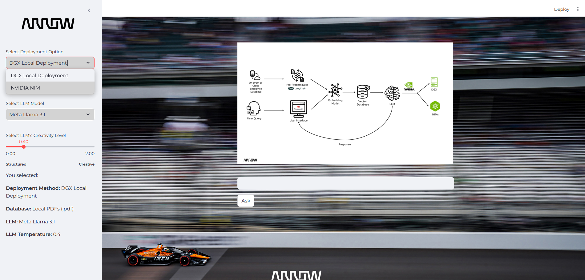
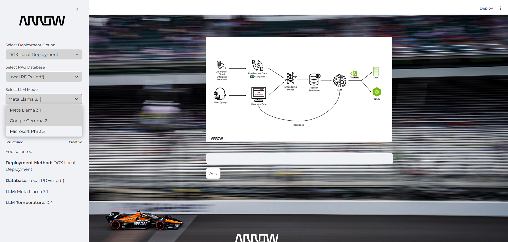
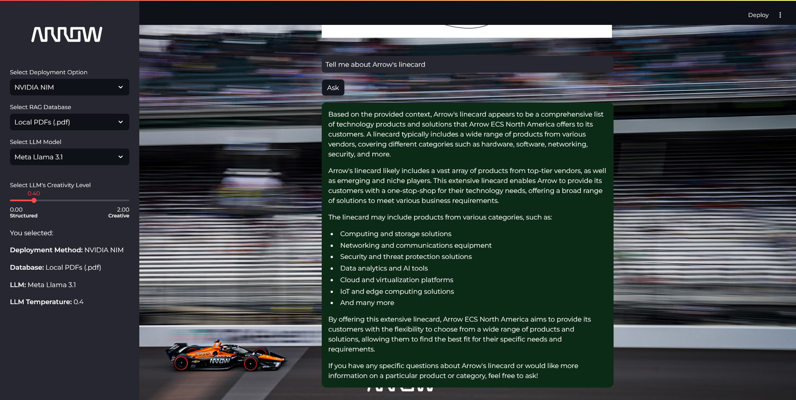
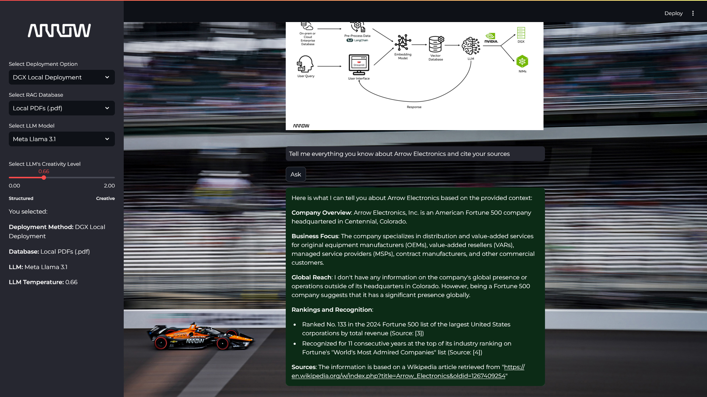

# Welcome to Arrow RAG Assistant Demo! 

This demo demonstrates how to easily deploy and customize a **Retrieval Augmented Generation (RAG)** model using **NVIDIA NIMs** or locally on **NVIDIA DGX** or another other local hardware, enabling high-performance inference for enterprise use cases.


RAG, or Retrieval Augmented Generation, is a framework that combines the strengths of large language models (LLMs) and external knowledge retrieval systems. It allows the model to fetch relevant information from external sources, such as databases or knowledge bases, during the generation process, improving accuracy and relevance while reducing hallucinations.



## Features

This demo offers flexibility and customization in the following areas:

**Deployment Options**: Choose between hosting the LLM locally or using NVIDIA NIMs.



**Retrieval Sources**: You can select from different retrieval sources, including uploading a PDF, using previously chosen PDFs about Arrow Electronics in the "docs" folder, or specifying URLs in rag_engine.py file. 


**LLM Selection**: The demo currently features LLaMA 3.1, Phi 3.5, and Gemma 2. However, you can swap out these models for any compatible LLM.

**LLM Parameters**: Use an interactive slider to adjust model parameter temperature. The code can also be customized to modify additional properties such as top-k or top-p values, allowing fine-tuning of the model's output.




**Application & UI Customization**: 

This demo is built using LangChain for the RAG process and Streamlit for the frontend, providing a seamless, interactive experience. You can personalize the theme, font, and branding to suit your preferences.


## Running the Demo

Follow these steps to set up and run the demo:

**1. Install Ollama and LLM Models**

Install [Ollama](https://ollama.com) and ensure the LLM models you want to use are installed. Run the following command for each model:

```ollama pull <modelname>```

Example: 

```ollama pull llama3.1 ```

```ollama pull phi3.5```

```ollama pull gemma2```


**2. Install Required Packages**

Install the necessary Python packages listed in requirements.txt:

```pip install -r requirements.txt```

**3. Set NVIDIA_API_KEY**:

Generate your API key from [NVIDIA NIMs API Catalog](https://build.nvidia.com/explore/discover) and run the following command in your environment's terminal: 

```NVIDIA_API_KEY='nvapi-???' ```

This step is required to run the demo properly. 

**4. Run the Frontend**
Start the Streamlit app:

```streamlit run rag.py```

**4. Open Port 8501**

Make sure port 8501 is open on your localhost to access the demo in your browser. You can change the port in config.toml file in the .streamlit folder. 

**5. Experiment with the Demo**

Explore the demo and experiment with different deployment, retrieval, and model options to see how RAG can improve inference for your use cases.





## Additional Resources

* [NVIDIA NIM API Catalog](https://build.nvidia.com/explore/discover)

* [LangChain Documentation](https://python.langchain.com/docs/introduction/)

* [Streamlit Documentation](https://docs.streamlit.io)

* [Ollama Installation](https://ollama.com)